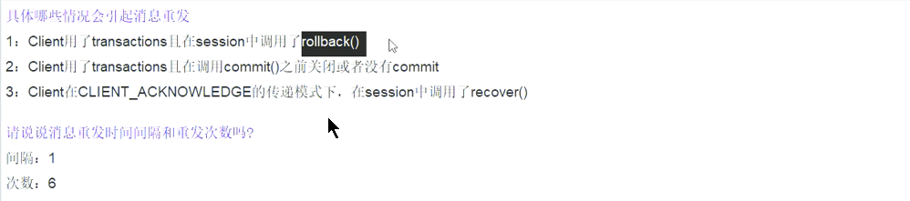

# activemq

## ActiveMQ学习demo ##

    1. 先生产  再启动1号消费者，1号消费者能消费到信息。
    2. 先生产，依次启动1号、2号消费者。1号回把全部的消息都消费，2号没有消息消费。
    3. 先启动2个消费者，再生产6条消息
    	3.1. 两个消费者一人一半，轮流获取一条，先到先得。
    	3.2 receive()同步阻塞，监听器方式是异步方式。
    4. topic的消息，在订阅之后所有消费者能都收到全部消息，订阅之前的收不到 
    5. MQ挂了，持久化的消息依然存在，非持久化的将消失。默认是持久化
    6. topic类型，先运行消费者，等于向MQ注册，类似于我订阅了这个主题，然后在运行生产者发送消息，此时，不管消费者是否在线，都会收到，不在线的话，下次链接的时候，回把没接收到过的信息都接受下来
    7. 事务开启后，需要commit()。

##持久化:文件持久化
配置kahaDB方式开启

### kahaDB以文件的方式持久化 ###
**db log files**：以db-递增数字.log命名。
**archive directory: **当配置支持archiving(默认不支持)并且存在，该文件夹才会创建。用于存储不再需要的data logs。
**db.data：**存储btree索引
**db.redo：**用于hard-stop broker后，btree索引的重建

##持久化:JDBC持久化
需要添加mysql的connector的jar包到lib目录下

配置数据源，如要配置其他的数据源，那就要额外添加jar包到lib目录下

##集群：zookeeper+levelDB
1. 先配置三台zookeepers集群，并启动。
**批处理**

2. 复制三个ActiveMQ

3. 修改管理控制台端口jetty.xml，默认的时8161

4. 还可以修改linux下的IP地址映射（vim /etc/hosts）

5. 把三个brokername都配置一样(active.xml)

6. 三个节点的持久化配置，修改其余两个的ActiveMQ的端口（61616）

***

##高级特性
异步投递

***

延迟投递
修改activemq.xml配置scheduleSupport属性为true，在broker标签中加入

> ActiveMQ对消息延时和定时投递做了很好的支持，其内部启动Scheduled来对该功能支持，也提供了一个封装的消息类型：org.apache.activemq.ScheduledMessage，只需要把几个描述消息定时调度方式的参数作为属性添加到消息，broker端的调度器就会按照我们想要的行为去处理消息。

**代码：**

    public class Producer {
 
	public static final String broker_url = "failover:(tcp://10.1.199.169:61616)";
	private static String queue_name = "test.queue";
 
	public static void main(String[] args) throws Exception {
		ConnectionFactory factory = new ActiveMQConnectionFactory(ActiveMQConnection.DEFAULT_USER, ActiveMQConnection.DEFAULT_PASSWORD, broker_url);
		// 通过工厂创建一个连接
		Connection connection = factory.createConnection();
		// 启动连接
		connection.start();
		// 创建一个session会话 事务 自动ack
		Session session = connection.createSession(Boolean.TRUE, Session.AUTO_ACKNOWLEDGE);
		// 创建一个消息队列
		Destination destination = session.createQueue(queue_name);
		// 创建生产者
		MessageProducer producer = session.createProducer(destination);
		// 消息持久化
		producer.setDeliveryMode(DeliveryMode.PERSISTENT);
		TextMessage message = session.createTextMessage("test delay message:" + System.currentTimeMillis());
		long time = 60 * 1000;// 延时1min
		long period = 10 * 1000;// 每个10s
		int repeat = 6;// 6次
		message.setLongProperty(ScheduledMessage.AMQ_SCHEDULED_DELAY, time);
		message.setLongProperty(ScheduledMessage.AMQ_SCHEDULED_PERIOD, period);
		message.setIntProperty(ScheduledMessage.AMQ_SCHEDULED_REPEAT, repeat);
		// 发送消息
		producer.send(message);
		session.commit();
		producer.close();
		session.close();
		connection.close();
		}
    }
***

    public class Consumer {
 
	public static final String broker_url = "failover:(tcp://10.1.199.169:61616)";
	private static String queue_name = "test.queue";
 
	public static void main(String[] args) throws Exception {
		ConnectionFactory factory = new ActiveMQConnectionFactory(ActiveMQConnection.DEFAULT_USER, ActiveMQConnection.DEFAULT_PASSWORD, broker_url);
		// 通过工厂创建一个连接
		Connection connection = factory.createConnection();
		// 启动连接
		connection.start();
		// 创建一个session会话 事务 自动ack
		Session session = connection.createSession(Boolean.TRUE, Session.CLIENT_ACKNOWLEDGE);
		// 创建一个消息队列
		Destination destination = session.createQueue(queue_name);
		// 创建消费者
		MessageConsumer consumer = session.createConsumer(destination);
		consumer.setMessageListener(new MessageListener() {
			@Override
			public void onMessage(Message message) {
				try {
					System.out.println("receive message ：" + ((TextMessage) message).getText());
					message.acknowledge();
				} catch (JMSException e) {
					e.printStackTrace();
				}
			}
		});
		new CountDownLatch(1).await();
		}
    }

分发策略

重试机制的属性配置

 有毒消息Poison ACK谈谈你的理解

 死信队列

